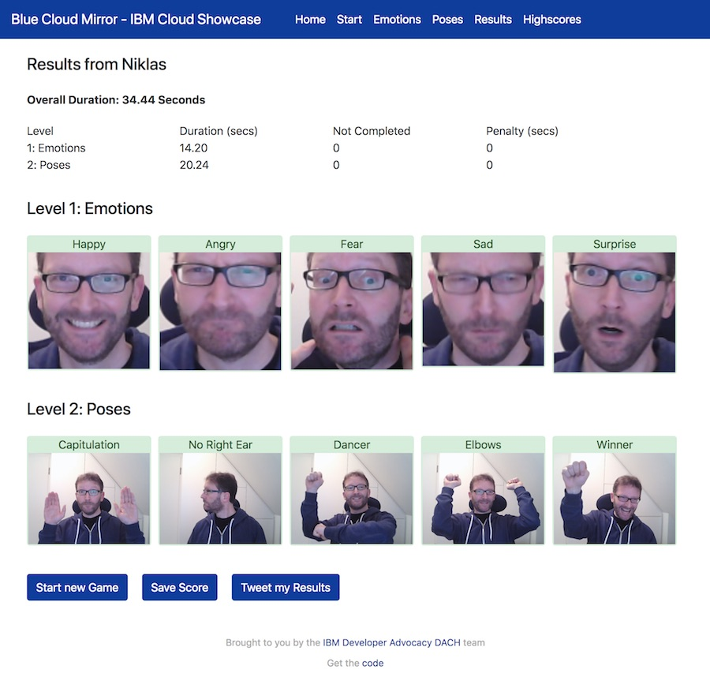
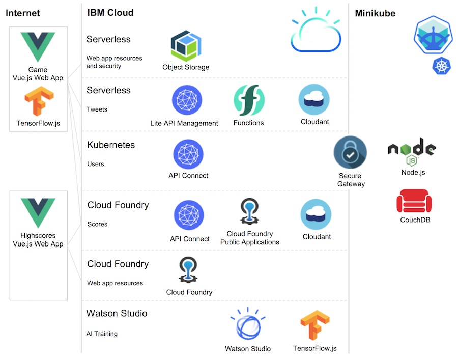

# Blue Cloud Mirror - IBM Cloud Technology Showcase

This project contains a game where players need to show five specific emotions and do five specific poses in two levels. The fastest player wins. The game uses various key cloud technologies to demonstrate the value of a diverse, interconnected system, with both public and private cloud environments.

[Play the Game.](https://blue-cloud-mirror.mybluemix.net/)

Here is an example of a successful game:



**Showcase of IBM Cloud Technologies**

The game utilizes various key IBM Cloud technologies to demonstrate the value of the IBM Cloud. There are three main parts:

* Core game: Implemented as serverless web application since it is primarily used during conferences only
* Users service: Implemented via IBM Cloud Private to avoid storing personal data in a public cloud
* Scores service: Implemented via Cloud Foundry Enterprise Edition to highlight easy changes via the ‘cf push experience’ (for example theme adoptions for different conferences)

**Note:** In order to allow developers to easily set up the game with an IBM Cloud Lite account, this project contains documentation how to use Cloud Foundry Publication Applications rather than Cloud Foundry Enterprise Environment and how to use Minikube rather than IBM Cloud Private.

The following diagram shows the key components that are used in this project. More diagrams, including a diagram showing IBM Cloud Private and Cloud Foundry Enterprise Environment, can be found in the [images](https://github.com/IBM/blue-cloud-mirror/tree/master/images) folder.



This is a list of used technologies:
* [IBM Cloud](https://cloud.ibm.com/)
* [IBM Cloud Private](https://www.ibm.com/cloud/private)
* [IBM Cloud Functions](https://cloud.ibm.com/openwhisk)
* [IBM Cloud Foundry Enterprise Edition](https://cloud.ibm.com/cfadmin/create)
* [IBM Cloud Foundry Public Applications](https://cloud.ibm.com/catalog?search=runtime)
* [IBM Cloud Object Storage](https://cloud.ibm.com/catalog/services/cloud-object-storage)
* [IBM API Connect](https://cloud.ibm.com/catalog/services/api-connect)
* [IBM Secure Gateway](https://cloud.ibm.com/catalog/services/secure-gateway)
* [IBM Watson Studio](https://dataplatform.cloud.ibm.com/)
* [IBM App ID](https://cloud.ibm.com/catalog/services/app-id)
* [IBM Cloudant](https://cloud.ibm.com/catalog/services/cloudant)
* [Apache CouchDB](https://couchdb.apache.org/)
* [TensorFlow.js](https://js.tensorflow.org)
* [Vue.js](https://vuejs.org/)
* [Minikube](https://github.com/kubernetes/minikube)

## Authors

* [Niklas Heidloff](https://twitter.com/nheidloff)
* [Thomas Südbröcker](https://twitter.com/tsuedbroecker)
* [Harald Uebele](https://twitter.com/harald_u)

## Documentation and Articles

* [One Minute Video](https://www.youtube.com/watch?v=RxPvvCUwclM)
* Code Pattern: [Mirror game app showcases 15 cloud technologies and components](https://developer.ibm.com/patterns/cloud-showcase-blue-mirror/)
* [Introducing Blue Cloud Mirror, a Fun IBM Cloud Showcase](http://heidloff.net/article/introducing-blue-cloud-mirror)
* [Blue Cloud Mirror Architecture Diagrams](http://heidloff.net/article/blue-cloud-mirror-architecture-diagrams)
* [Three Minutes Video](https://www.youtube.com/watch?v=jkDWoHjMAig)
* [Screenshots and Diagrams](https://github.com/IBM/blue-cloud-mirror/tree/master/images)
* [Three awesome TensorFlow.js Models for Visual Recognition](http://heidloff.net/article/tensorflowjs-visual-recognition)
* [Serverless Vue.js Applications on the IBM Cloud](http://heidloff.net/article/serverless-vuejs-ibm-cloud)
* [Blue Cloud Mirror — A fun IBM Cloud showcase](https://haralduebele.blog/2019/01/31/blue-cloud-mirror-a-fun-ibm-cloud-showcase/)
* [Blue Cloud Mirror – Of Kubes and Couches](https://haralduebele.blog/2019/02/01/blue-cloud-mirror-of-kubes-and-couches/ )
* [IBM Secure Gateway Setup](https://haralduebele.blog/2019/02/17/blue-cloud-mirror-dont-open-the-doors/)
* [Awesome Developer Experience with Vue.js](http://heidloff.net/article/awesome-developer-experience-vuejs)
* [Videos: How to setup the Highscores part in IBM Cloud?](https://www.youtube.com/playlist?list=PLUte4WEyMEjWjJSL_MG692rL_hOna7MbD)
* [Highscores overview blog post](https://suedbroecker.net/2019/02/01/bluecloudmirror-game-highscores/)

## Setup

In the easiest case the game can be set up on a local machine in less than five minutes. In this case only the game web application is run without being able to register users and having highscores. To set up the game locally, make sure you have installed the first four prerequisites below ([git](https://git-scm.com/downloads), [node](https://nodejs.org/en/download/), [vue](https://cli.vuejs.org/) and [yarn](https://yarnpkg.com/lang/en/docs/install/#mac-stable)).

Then invoke the following commands:

```
$ git clone https://github.com/IBM/blue-cloud-mirror.git
$ cd blue-cloud-mirror/game
$ yarn install
$ yarn run serve
```

The full setup includes IBM Cloud Functions, Cloud Foundry and an on-premises environment. Please refer to the instructions of the three main components:

* [Game](game/README.md): Web application hosted on the IBM Cloud
* [Scores service](scores/README.md): API and web application hosted on the IBM Cloud
* [Users service](users/README.md): API hosted on-premises

## Prerequisites

For all three components, you need the following prerequisites. 

Create an IBM Cloud lite account (free, no credit card required):

* [IBM Cloud account](https://ibm.biz/nheidloff)

Make sure you have the following tools installed:

* [git](https://git-scm.com/downloads)
* [node](https://nodejs.org/en/download/)
* [vue](https://cli.vuejs.org/)
* [yarn](https://yarnpkg.com/lang/en/docs/install/#mac-stable)
* [ibmcloud](https://console.bluemix.net/docs/cli/index.html)
* [curl](https://curl.haxx.se/download.html)
* [kubectl](https://kubernetes.io/docs/tasks/tools/install-kubectl/)

## Local Environment Setup

Invoke the following commands:

```
$ git clone https://github.com/IBM/blue-cloud-mirror.git
$ cd blue-cloud-mirror/
$ ibmcloud login
$ ibmcloud iam api-key-create blue-cloud-mirror \
  -d "blue-cloud-mirror" \
  --file blue-cloud-mirror.json
$ cat blue-cloud-mirror.json
$ cp template.local.env local.env
```

In [local.env](local.env) define 'IBMCLOUD_API_KEY', 'IBMCLOUD_ORG', 'IBMCLOUD_SPACE' and 'BLUEMIX_REGION' to match the apikey in [blue-cloud-mirror.json](blue-cloud-mirror.json) and the org, space and region name that you're using (see the outputs in your terminal when following the steps above).
