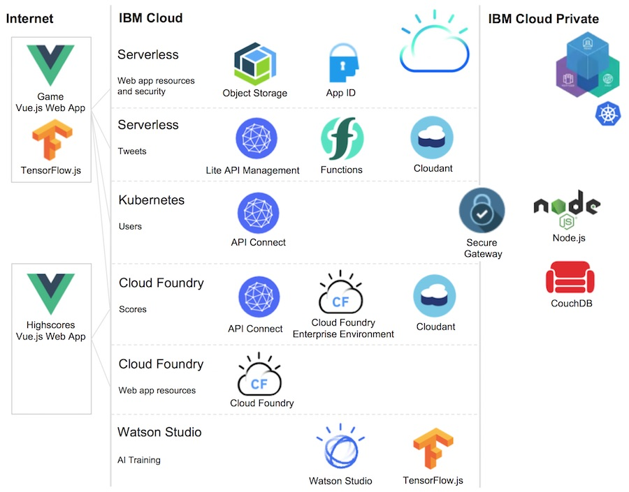

# Blue Cloud Mirror - IBM Cloud Technology Showcase

This project contains a game where players need to show five specific emotions and do five specific poses in two levels. The fastest player wins.

[Play the Game.](https://blue-cloud-mirror.mybluemix.net/)

Here is an example of a successful game:


**Showcase of IBM Cloud Technologies**

The game utilizes various key IBM Cloud technologies to demonstrate the value of the IBM Cloud.

The game has three main parts:
* Core game: Implemented as web application and via Cloud Functions since it is only used during conferences
* User management service: Implemented via IBM Cloud Private to avoid having the personal data in a public cloud
* Highscore list: Implemented via Cloud Foundry Enterprise Edition to show easy theme adoptions for different conferences

This diagram shows the key components:



This is a list of used technologies:
* [IBM Cloud](https://cloud.ibm.com/)
* [IBM Cloud Private](https://www.ibm.com/cloud/private)
* [IBM Cloud Functions](https://cloud.ibm.com/openwhisk)
* [IBM Cloud Foundry Enterprise Edition](https://cloud.ibm.com/cfadmin/create)
* [IBM Cloud Foundry Public Applications](https://cloud.ibm.com/catalog?search=runtime)
* [IBM Cloud Object Storage](https://cloud.ibm.com/catalog/services/cloud-object-storage)
* [IBM API Connect](https://cloud.ibm.com/catalog/services/api-connect)
* [IBM Secure Gateway](https://cloud.ibm.com/catalog/services/secure-gateway)
* [IBM Watson Studio](https://dataplatform.cloud.ibm.com/)
* [IBM App ID](https://cloud.ibm.com/catalog/services/app-id)
* [IBM Cloudant](https://cloud.ibm.com/catalog/services/cloudant)
* [Apache CouchDB](https://couchdb.apache.org/)
* [TensorFlow.js](https://js.tensorflow.org)
* [Vue.js](https://vuejs.org/)
* [Minikube](https://github.com/kubernetes/minikube)

## Authors

* [Niklas Heidloff](https://twitter.com/nheidloff)
* [Thomas Südbröcker](https://twitter.com/tsuedbroecker)
* [Harald Uebele](https://twitter.com/harald_u)

## Documentation and Articles

* [Introducing Blue Cloud Mirror, a Fun IBM Cloud Showcase](http://heidloff.net/article/introducing-blue-cloud-mirror)
* [Blue Cloud Mirror Architecture Diagrams](http://heidloff.net/article/blue-cloud-mirror-architecture-diagrams)
* [Three Minutes Video](https://www.youtube.com/watch?v=jkDWoHjMAig)
* [Screenshots and Diagrams](https://github.com/IBM/blue-cloud-mirror/tree/master/images)
* [Three awesome TensorFlow.js Models for Visual Recognition](http://heidloff.net/article/tensorflowjs-visual-recognition)
* [Serverless Vue.js Applications on the IBM Cloud](http://heidloff.net/article/serverless-vuejs-ibm-cloud)
* [Awesome Developer Experience with Vue.js](http://heidloff.net/article/awesome-developer-experience-vuejs)
* [Videos: How to setup the Highscores part in IBM Cloud?](https://www.youtube.com/playlist?list=PLUte4WEyMEjWjJSL_MG692rL_hOna7MbD)
* [High scores overview blog post](https://suedbroecker.net/2019/02/01/bluecloudmirror-game-highscores/)

## Setup

In the easiest case the game can be set up on a local machine in less than five minutes. In this case only the game web application is run without being able to register users and having highscores. To set up the game locally, invoke the following commands:

```
$ git clone https://github.com/IBM/blue-cloud-mirror.git
$ cd blue-cloud-mirror/game
$ yarn install
$ yarn run serve
```

The full setup includes IBM Cloud Functions, Cloud Foundry Public Applications on the IBM Cloud and IBM Cloud Private. Please refer to the instructions of the three main components:

* [Game](game/README.md): Web application hosted on IBM Cloud Functions
* [Highscores](scores/README.md): API and web application hosted via Cloud Foundry Public Applications
* [Users](users/README.md): API hosted on IBM Cloud Private

## Prerequisites

For all three components, you need the following prerequisites. 

Create an IBM Cloud lite account (free, no credit card required):

* [IBM Cloud account](https://ibm.biz/nheidloff)

Make sure you have the following tools installed:

* [git](https://git-scm.com/downloads)
* [ibmcloud](https://console.bluemix.net/docs/cli/index.html)
* [node](https://nodejs.org/en/download/)
* [curl](https://curl.haxx.se/download.html)
* [vue](https://cli.vuejs.org/)
* [yarn](https://yarnpkg.com/lang/en/docs/install/#mac-stable)
* [kubectl](https://kubernetes.io/docs/tasks/tools/install-kubectl/)

## Local Environment Setup

Invoke the following commands:

```
$ git clone git@github.ibm.com:niklas-heidloff/visual-recognition-demo.git
$ cd visual-recognition-demo/
$ ibmcloud login
$ ibmcloud target --cf
$ ibmcloud iam api-key-create emotion-recognition-application \
  -d "emotion-recognition-application" \
  --file emotion-recognition-application.json
$ cat emotion-recognition-application.json
$ cp template.local.env local.env
```

In [local.env](local.env) define 'IBMCLOUD_API_KEY', 'IBMCLOUD_ORG', 'IBMCLOUD_SPACE' and 'BLUEMIX_REGION' to match the apikey in [emotion-recognition-application.json](emotion-recognition-application.json) and the org, space and region name that you're using (see the outputs in your terminal when following the steps above).