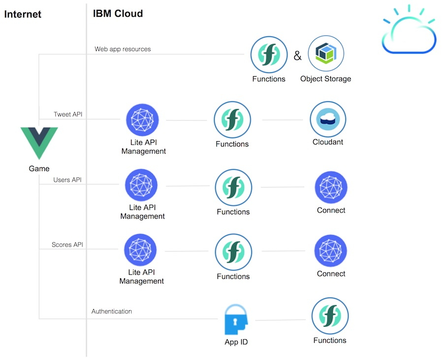

# Emotions and Poses Game: Web Application

The web application has been implemented via Vue.js and uses three different TensorFlow.js models to recognize faces, emotions and poses.

* Faces: [face-api.js](https://github.com/justadudewhohacks/face-api.js)
* Emotions: [face_classification](https://github.com/oarriaga/face_classification) and [face-classification-js](https://github.com/tupleblog/face-classification-js)
* Poses: [posenet](https://github.com/tensorflow/tfjs-models/tree/master/posenet)

In order to train models on the IBM Cloud, read my article [Training TensorFlow.js Models with IBM Watson](http://heidloff.net/article/tensorflowjs-ibm-watson-web-browsers-dl).

The web application can be hosted and run in four different ways:

* [Locally on a developer machine](#option-1:-local-setup-of-the-web-application)
* [Cloud Foundry Public Application](#option-2a:-deployment-to-cloud-foundry)
* [Serverless with Cloud Object Storage](#option-2b1:-cloud-object-storage)
* [Serverless with Cloud Object Storage and Custom Domain](#option-2b2:-cloud-object-storage-and-custom-domain)

## Option 1: Local Setup of the Web Application

In the easiest case the game can be set up on a local machine in less than five minutes. In this case only the game web application is run without being able to register users and having highscores. To set up the game locally, make sure you have installed the first four prerequisites below ([git](https://git-scm.com/downloads), [node](https://nodejs.org/en/download/),  [vue](https://cli.vuejs.org/) and [yarn](https://yarnpkg.com/lang/en/docs/install/#mac-stable)).

Then invoke the following commands:

```
$ git clone https://github.com/IBM/blue-cloud-mirror.git
$ cd blue-cloud-mirror/game
$ yarn install
$ yarn run serve
```

Invoke http://localhost:8080 in Chrome to launch the application.

## Option 2: Deployment to the IBM Cloud

The application can be deployed to the IBM Cloud in two different ways.

* Cloud Foundry Public Application
* Serverless application via Cloud Functions and Object Storage

**Users and Highscores**

In both cases the users API and highscores APIs are optional. If these two components have been set up, the two endpoints are needed.

In [local.env](local.env) define 'API_USERS' and 'API_SCORES'. After this run the following command:

```
$ scripts/game-configure-apis.sh
```

**Tweets**

In order to tweet a picture of the results, additional components need to be set up.

Run the following command to create a new Cloudant service instance. Note that the IBM Cloud lite account only allows one instance. If you have already an instance, define 'CLOUDANT_USERNAME' and 'CLOUDANT_PASSWORD' in [local.env](local.env).

```
$ scripts/twitter-setup-cloudant-service.sh
```

To create the database, run the following command:

```
$ scripts/twitter-setup-cloudant-database.sh
```

To create the two OpenWhisk functions and two APIs, run the following command:

```
$ scripts/twitter-deploy-functions.sh
```

### Option 2a: Deployment to Cloud Foundry

To deploy the web application to Cloud Foundry (as public application), invoke the following command:

```sh
$ scripts/game-deploy-cloud-foundry.sh
```

The URL to launch the application (e.g. https://blue-cloud-mirror.mybluemix.net) will be displayed as output of the script.

_Note:_ If you get the following error in the `scripts/game-deploy-cloud-foundry.log` you have to change the `hostname` in the `game/manifest.yml` file to a unique name for example `blue-cloud-mirror-myname`.
```sh
FAILED
Server error, status code: 400, error code: 210003, message: The host is taken: blue-cloud-mirror
```


### Option 2b: Deployment as Serverless Application

The application can also be deployed as serverless application. The static file resources are stored on [IBM Cloud Object Storage](https://console.bluemix.net/catalog/services/cloud-object-storage). 

Note: The IBM Cloud lite plan only allows one Object Storage instance in your organization. If you have already an instance, enter the variable 'COS_ID' in [local.env](local.env) which you can get by invoking the following command:

```
$ ibmcloud resource service-instance object-storage-emotions
```

In order to create a new instance, run the following command:

```
$ scripts/object-storage-create-service.sh
```

There are two options to deploy the web application as serverless application which have pros and cons.

#### Option 2b1: Cloud Object Storage

One disadvantage of this option is that the URL will be rather long, e.g. https://s3.us-south.objectstorage.softlayer.net/emotions-demo-niklasheidloffdeibmcom/index.html. Custom domains cannot be used.

Another advantage is that you can only invoke the URL 'https://xxx/index.html'. You can not invoke 'https://xxx/home', 'https://xxx/start', etc. and page reloads don't work.

In order to create a new bucket, run the following command:

```
$ scripts/object-storage-create-bucket.sh
```

In order to upload the files, run the following command:

```
$ scripts/object-storage-upload-files.sh
```

The URL to launch the application (e.g. https://s3.us-south.objectstorage.softlayer.net/emotions-demo-niklasheidloffdeibmcom/index.html) will be displayed as output of the script.

#### Option 2b2: Cloud Object Storage and Custom Domain

One advantage of this option is that you can use a custom domain, e.g. https://www.heidloff.eu/demo/game.

Another advantage is that you can open pages like 'https://xxx/start' directly and page reloads work too.

Unfortunately we haven't managed yet to configure CORS for Cloud Object Storage when loading the models. As a result the application will throw CORS errors in the developer console and the levels cannot be played. As a temporary workaround you can install the Chrome CORS extension [Allow-Control-Allow-Origin: *](https://chrome.google.com/webstore/detail/allow-control-allow-origi/nlfbmbojpeacfghkpbjhddihlkkiljbi?hl=en).

In order to create a new bucket, run the following command:

```
$ scripts/object-storage-create-bucket-domain.sh
```

In order to upload the files, run the following command:

```
$ scripts/object-storage-upload-files-domain.sh
```

In order to use a custom domain, IBM Cloud Functions are used. Run the following command to set everything up:

```
$ scripts/openwhisk-create-html.sh
```

Open the application in Chrome, e.g. https://www.heidloff.eu/demo/game.

This diagram shows the key components:

