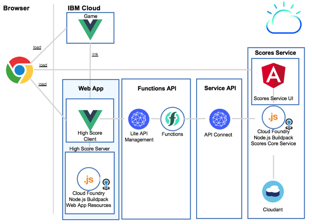

# Scores Service and WebApp

## Objective

* Setup the **Scores Service and WebApp**

Test the 
[YouTube playlist](https://www.youtube.com/playlist?list=PLUte4WEyMEjWjJSL_MG692rL_hOna7MbD) with a sample setup for all scores parts.

---
## Services used

* Cloud Foundry Apps Node.js Buildpack
* Cloudant
* Cloud Functions
* Lite API Management
* API Connect

---
## Architecture

This is a simplified view on the scores architecture.



Here is a small description for each major elements in the diagram.

* **WebApp**
  
  The WebApp is the **High Scores WebApp** for the **Blue Cloud Mirror Game**.
  It is implemented in **VUE** and runs on a **Cloud Foundry service** in the IBM Cloud.
  At the moment the documentation is only for **Cloud Foundry Apps**, but in future documentation the deployment to **Cloud Foundry Enterprise Environment** will be added. 
  
  The execution is tested on a Chrome browser.

  The App consumes the scores **functions API** to **display the scores list** and **high scores**. You can also **delete scores** from this list.

  You can navigate from the **High Scores App** to the **Blue Cloud Mirror Game**.

  At the moment there is no auth implemented in the game app, to display or delete scores from this App.
  But this will be realized with usage of the [**APP ID**](https://www.ibm.com/cloud/app-id) service inside the **Functions API** in the future.

  To ensure no password is stored inside the browser, when using the WebApp, the current **functions API** does not request user auth.

* **Functions API**
   
  The **functions API** is our serverless approach to secure the **service API** or directly the **scores service**. 
  Later it will be possible integrate with the APP ID service to secure the access to the API with a OOTB user login.
    
  At the moment the IBM Lite API management exposes the APIs, which are implemented with **actions** or **sequences** inside IBM Functions. [IBM Functions](https://console.bluemix.net/openwhisk/) is based on [Apache OpenWhisk](https://openwhisk.apache.org/).

  Inside the **actions**, the access to the **service API** or directly to **scores service** is enabled and can be configured. The action do contain the **auth** information for each of them.

* **Service API**

  The **service API** is realized with the **API Connect**. It exposes a subset of the functionality from the **scores service**.
  The exposed API is secured with **auth key**.

* **Scores Service**
  
  The **scores service** implements the access to a nosql database Cloudant. The major objective of **scores service** is to provide the add score and list score functionality.
   
---
## Setup Instructions

The setup is organized in separated chapters.

Each chapter does setup a single part of the architecture. The setup is mostly automated with bash scripts. 
To configure these bash scripts you need to insert values in the **scores.local.root.env** file. Just copy and paste the file  **scores.local.root.env-template** and rename the file to **scores.local.root.env**.

There are two major steps the **core scores services** and the **High Score Web App** setup.

_Note:_ The setup description is for IBM Cloud, but you can run the Node.js apps also locally.
The **scores service** uses port `3000` and **webapp server** the port `3001`.

Sample for the **scores service**.

 * Install
 ```sh
 npm install
 bower install
 ```
 * Run locally
 ```sh
 npm start
 > node server.js
 Listening on port (3000)
 ```

* Browser URL: localhost:3000


## 1. Core scores services setup

These are the three steps to setup the core scores services.

1. [Service](./service) 
You must setup the **Scores Service**, the result is needed in the **service api**. 
2. [Service API](./service-api) 
The **Service API** can be **optional**, if you decide not to use the API Connect instance on IBM Cloud as input for the **Functions API**.
3. [Functions API](./functions-api)
The **Functions API** is a must for the setup, because this API is used in the **High Scores Web App**.

## 2. High Score Web App setup

* [High Score Web App](./webapp)
The **High Scores Web App** is integrated with the **Game App** and consumes the **Scores Functions API**.

