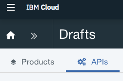
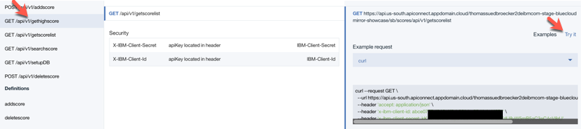

# Service API

[Back to setup scores and webapp overview](../README.md) 

## Objective

* Setup the **service API**

Take 4 minutes and have a look in the YouTube video: How to setup the scores service api?
[](https://www.youtube.com/watch?v=7zFCqJ0lRo4 "Click play on youtube")

---

## Services used

* API Connect

---

## Architecture

  The **service API** is realized with the [**API Connect**](https://www.ibm.com/cloud/api-connect). It exposes a subset of the functionality from the **scores service**.
  The exposed API is secured with **auth key**.

In the following image you can see the dependencies of **scores service**, **service API** and **functions API**.


---

## Setup the score service API on IBM Cloud

The setup is partly automated in a bash script.
You need a IBM Cloud account and an IBM platform key.

This is an overview of the steps you have to follow.

1. [Get IBM platform key](#part-SETUP-00)
2. [Configurations for bash script automation](#part-SETUP-01)
3. [Enable the bash script for automation](#part-SETUP-02)
4. [Execute the bash script and create the API Connect instance](#part-SETUP-03)
5. [Use API Connect to create a managed scores service API](#part-SETUP-04)
6. [Save the relevant information for the scores-functions-API](#part-SETUP-05)

### 1. Get IBM platform key <a name="part-SETUP-00"></a>

_Note:_ You don't have to do this step, if you already have an IBM platform key.

1. Logon to IBM Cloud use the **"us-south"** Region with the  **https://api.ng.bluemix.net** API endpoint.
```
ibmcloud login -a https://api.ng.bluemix.net --install
```

2. Create a IBM platform for your API key and name it (example **my-ibmplatform-key**) and provide a filename  (example **my-ibmplatform-key-key_file**).
```
ibmcloud iam api-key-create my-ibmplatform-key -d "This is my API key to access the IBM platform" --file my-ibmplatform-key-key_file
```

Leave your terminal open.

### 2. Configurations for bash script automation <a name="part-SETUP-01"></a>

1. Open the file **[YOUR-ROOT]bluecloudmirror/scores/scores.local.root.env**. This file contains environment variables.

2. Insert the needed values for following entries and do not change the rest.

   **Important for the setup:**
   - Resource Group is case sensitive depending on your system you have to change **d** efault** to **D** efault.
   _Login relevant:_

     * IBMCLOUD_CLI_DEVOPS_PLATFORM_KEY="**[YOUR_PLATFORM_KEY]**"
     * IBMCLOUD_USER_ID="**[YOUR_IBMCLOUD_ID]**"
     * IBMCLOUD_RESOURCE_GROUP=**"default" # or "Default"**

      _Service API relevant:_
      * IBMCLOUD_CF_APP_SERVICE_NAME="bluecloudmirror-scores-service-**[YOUR_NAME]**"
      * IBMCLOUD_CF_ORGANIZATION_NAME="**[YOUR_ORGANIZATION_NAME]**

### 3. Enable the bash script for automation <a name="part-SETUP-02"></a>

1. Return to your open terminal.
```
cd [YOUR-ROOT]/bluecloudmirror/scores/service-api
chmod u+x *.sh
```
### 4. Execute the bash script and create the API Connect instance <a name="part-SETUP-03"></a>

The bash script creates a API Connect service and prepares the API, based on **swagger file** as a template for the **scores service API**.

This file you will later import to configure the API in API Connect.

```sh
./ibmcloud-create-service-api.sh
```

Here is a sample output of the bash scipt.

```sh
1. Login to IBM Cloud

_set -o thomas.suedbroecker@de.ibm.com
_create -s 99-BLUECLOUDMIRROR-SHOWCASE
_set -s 99-BLUECLOUDMIRROR-SHOWCASE -g default

Login end

2. Create API Connect start

Create API Connect end

3. Configure API defintion start

__copy API Definition
__copy API Product Definition
__setup text-replace
__replace USER with admin
__replace PASSWORD with a12345678
__replace SCORES_SERVICE_URL with https://bluecloudmirror-scores-service-tsuedbro.mybluemix.net

Configure API defintion end
```

### 5. Use **API Connect** to create a managed scores service API <a name="part-SETUP-04"></a>

Just to give you basic a understanding on the dependencies we will use inside of API Connect. Take a look in the following image.


### a. Import API swagger defintion

1. Login to IBM Cloud

2. Open the dashboard and search for your API Connect instance **bluecloudmirror-score-api**

3. Click on **">>"**


4. Now select **"Drafts"**


5. Then choose the **"APIs"** tab



4. Click **"Add (+)"**, select **"Import API from file or URL"**

5. "Select File" **[scores/service-api/]scores-service-API-CF-1.0.0.yaml**


6. Check the box **"Add a product"** 


7. Enter for Title: **"Scores service API Product"**  

8. Insert as Name **"scores-service-api-product"**

7. Press **"Import"**

### 6. Publish the **service API**

1. Open the product with **">>"**

2. In **"Drafts"**, select **"Scores service API Product"**

3. Stage the product _(Cloud icon in title bar)_


4. select **"Sandbox"**. 
_NOTE:_ **Sandbox** is a **product catalog** already exists in API Connect.

Go to the Sandbox catalog with selecting 
5. Select **">>"** 

6. Now open the  **"Dashboard"**

7. Click on the **"Sandbox"** title


6. Click on the three dots for your product and **"Publish"** 


7. You can now test your **service API** with **"Explore"** located in the title bar of **API Connect** dashboard and select **Sandbox**.


8. Here you can explore the exposed **scores API**.


9. Now you can test the API, just select **gethighscore** and select **Try it**



10. Now press **Call operation**


11. Here you can verify the result


### 7. Save the relevant information for the functions-API <a name="part-SETUP-05"></a>

To use this **score service API** in the **functions-API** you need to insert following values in the **[YOUR-ROOT]bluecloudmirror/scores/scores.local.root.env** file.

1. Open the **score service API** with **"Explore"** located in the title bar of **API Connect** dashboard.


2. Select a from **Operations** (on the left hand side) **POST /api/v1/addscore**.

3. Open the in **Description** (in the middle)

4. Then choose **Example** and then press **Try it** and copy some values from CURL statement.

```sh
curl --request POST \
  --url https://api.us-south.apiconnect.appdomain.cloud/thomassuedbroeckerdeibmcom-99-bluemirror-demo-backend/sb/scores/api/v1/addscore \
  --header 'accept: application/json' \
  --header 'content-type: application/json' \
  --header 'x-ibm-client-id: THE_ID' \
  --header 'x-ibm-client-secret: THE_SECRET' \
  --data '{"firstName":"Thomas","lastName":"Michael","gameDate":"1547032734102","score":"100"}'
```

   **Note:** At the time of this writing there seems to be a bug in the **API Connect Explorer**. The URI in the CURL example is **incorrect**, it is sometimes missing **"scores"**. The URI of the header with the REST statement is always correct. 

5. Here you copy from the **URL parameter** the string until **api/v1/addscore**

  _Example:_  Copy only the base URL until "**api/v1/addscore**"
  
  "**https://api.us-south.apiconnect.appdomain.cloud/thomassuedbroeckerdeibmcom-99-bluemirror-demo-backend/sb/scores/**" - api/v1/addscore

_Note:_ This is **service API** information for the **functions API** configuration, you will configure later.

6. Insert the **URL** into the **[YOUR-ROOT]bluecloudmirror/scores/scores.local.root.env** file.

    * IBMCLOUD_SCOREAPI_URL="**YOUR_COPIED_URL**"

7. Also save the **x-ibm-client-id** and the **x-ibm-client-secret** in the environment file.

    * IBMCLOUD_SCOREAPI_CLIENT_ID=**"THE_ID"**
    * IBMCLOUD_SCOREAPI_CLIENT_SECRET=**"THE_ID"**

Move on to the next step [functions api](../functions-api/README.md) !


