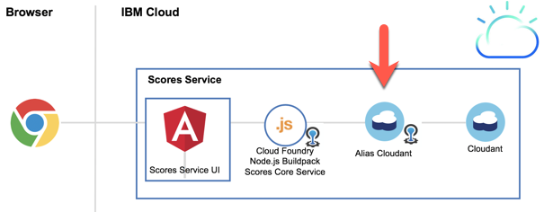

# Scores service

[Back to setup scores and webapp overview](../README.md) #

## Objective

* Setup the **scores service**

Take 3 minutes and have a look in the YouTube video: How to setup the scores service api?
[](https://www.youtube.com/watch?v=xpMjO9ZTzq0 "Click play on youtube")

---

## Services used

* Cloud Foundry Apps Node.js Buildpack
* Cloudant

---

## Architecture

The **scores service** is implemented as an Node.js server.
This service provides REST calls. The API Management for the REST calls is realized in the **score service API** and the 
**functions API**.

The service is storing the score data in the nosql database [Cloudant](https://www.ibm.com/cloud/cloudant).

In the following image you can see the dependencies of **scores service**, **service API** and **functions API**.

The focus is only on the  **scores service**.

**Overview**


**Detail**



* For the binding to the Cloud Foundry App a Cloud Foundry service alias is needed.

* Scores service UI

   The UI provides access to the REST calls from the **scores service**. Each REST call is secured by user and password auth.
   
* Scores service REST calls
   * Setup the database 
   * Search for scores 
   * Get the high score
   * Get the score list
   * Add a score value
   * Delete a score value

* Later exposed REST calls in the **scores API** and **functions API**
   * Get the score list
   * Add a score value
   * Delete a score value

---

## Setup the score service on IBM Cloud

The setup is mostly automated in bash scripts.
You need a IBM Cloud account and an IBM platform key.

This is an overview of the steps you have to follow.

1. [Get IBM platform key](#part-SETUP-00)
2. [Configurations for bash script automation](#part-SETUP-01)
3. [Enable the bash script for automation](#part-SETUP-02)
4. [Now execute the bash script and deploy the scores service](#part-SETUP-03)
5. [Verify the setup on IBM Cloud](#part-SETUP-04)
6. [The score-service ui](#part-SETUP-05)

### 1. Get IBM platform key <a name="part-SETUP-00"></a>

_Note:_ You don't have to do this step, if you already have an IBM platform key.

Logon to IBM Cloud and use the **"us-south"** Region with the  **https://api.ng.bluemix.net** API endpoint.
```
ibmcloud login -a https://api.ng.bluemix.net
```

Create a IBM platform for your API key and name it (example **my-ibmplatform-key**) and provide a filename  (example **my-ibmplatform-key-key_file**).
```
ibmcloud iam api-key-create my-ibmplatform-key -d "This is my API key to access the IBM platform" --file my-ibmplatform-key-key_file
```

Leave your terminal open.

### 2. Configurations for bash script automation <a name="part-SETUP-01"></a>

1. Open the file **[YOUR-ROOT]bluecloudmirror/scores/scores.local.root.env**.
This file contains environment variables.

2. Insert the needed values for following entries and do not change the rest.

   **Important for the setup:**
   - Resource Group is case sensitive depending on your system you have to change **d** efault** to **D** efault.
   _Login relevant:_

     * IBMCLOUD_CLI_DEVOPS_PLATFORM_KEY="**[YOUR_PLATFORM_KEY]**"
     * IBMCLOUD_USER_ID="**[YOUR_IBMCLOUD_ID]**"
     * IBMCLOUD_RESOURCE_GROUP=**"default" # or "Default"**

   _Cloud Foundry Apps and services relevant:_

      * IBMCLOUD_CF_APP_SERVICE_NAME="bluecloudmirror-scores-service-**[YOUR_NAME]**"
      * IBMCLOUD_CF_ORGANIZATION_NAME="**[YOUR_ORGANIZATION_NAME]**
      

### 3. Enable the bash script for automation <a name="part-SETUP-02"></a>

Return to your open terminal.
```
cd [YOUR-ROOT]/bluecloudmirror/scores/service
cd ./deploy-apps
chmod u+x *.sh
```

### 4. Now execute the bash script and deploy the scores service <a name="part-SETUP-03"></a>

This bash script will deploy the **scores service** as a **Cloud Foundry app**.
It will create a **Cloudant** service and bind the service to the **scores service** app.

The bash script shows the execution steps. Some steps do take time, be patient.

After the execution you can find a log file in the **./deploy_apps** folder. The log is called **ibmcloud-deploy-service-to-cf**. This log contains detailed information about the deployment.

Execute the bash script.

```sh
./ibmcloud-deploy-service-to-cf.sh
```
Sample output of the bash

```sh
./ibmcloud-deploy-service-to-cf.sh 
1. Login to IBM Cloud

_set -o thomas.suedbroecker@de.ibm.com
_create -s 99-BLUECLOUDMIRROR-SHOWCASE
_set -s 99-BLUECLOUDMIRROR-SHOWCASE -g default

Login end

2. Create scores cloudant DB start

_create bluecloudmirror-scores-service-db-alias
_create bluecloudmirror-scores-service-db-key
_get credentials
_create database
_upload view
_upload search index
_upload sample data

Create scores cloudant DB end

3. Deploy service start

_npm install
_bower install
_show existing spaces
_show existing apps
_push bluecloudmirror-scores-service-tsuedbro
_create binding
_restage binding bluecloudmirror-scores-service-tsuedbro
_application has been deployed 

Deploy service end
```

Now the **score service** is ready to be used.

### 5. Verify the setup on IBM Cloud <a name="part-SETUP-04"></a>

Login to IBM Cloud and verify the setup.

1. Login
2. Open **Resource List**
3. Type "blue" in the **Name** search field
4. Verify the entries in the resource list:


### 6. The score-service ui <a name="part-SETUP-05"></a>

After the execution you can open the URL:https://bluecloudmirror-score-service- *[YOUR_NAME]* .mybluemix.net and access the **score-service ui**.


Move on to the next step [service-api](../service-api/README.md) !


