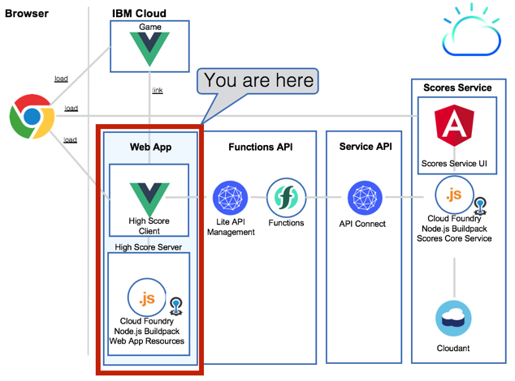
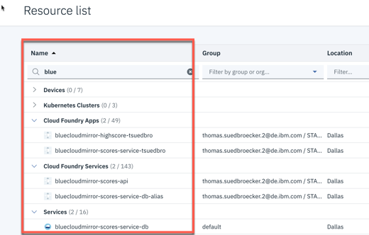
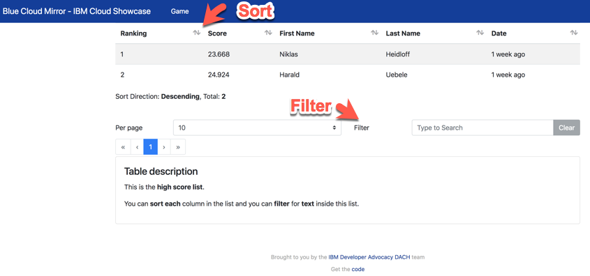
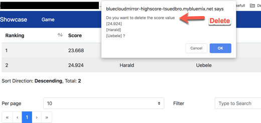

# WebApp 

[Back to setup scores and webapp overview](../README.md) 

## Objective

* Setup the **webapp**

Take 3 minutes and have a look in the YouTube video: How to setup the scores webapp?
[](https://www.youtube.com/watch?v=KSN_hZHgGso "Click play on youtube")

---

## Services used

* Cloud Foundry Apps Node.js Buildpack

---

## Architecture

The WebApp is the **High Scores WebApp** for the **Blue Cloud Mirror Game**.
  It is implemented in **VUE** and runs on a **Cloud Foundry service** in the IBM Cloud.
  At the moment the documentation is only for **Cloud Foundry Apps**, but in future documentation the deployment to **Cloud Foundry Enterprise Environment** will be added. 
  
  The execution is tested on a Chrome browser.

  The App consumes the scores **functions API** to **display the scores list** and **high scores**. You can also **delete scores** from this list.

  You can navigate from the **High Scores App** to the **Blue Cloud Mirror Game**.

  At the moment the there is no auth implemented in the game app, to display or delete scores from this App.
  But this will be realized with usage of the [**APP ID**](https://www.ibm.com/cloud/app-id) service inside the **Functions API** in the future.

  To ensure no password is stored inside the browser, when using the WebApp, the current **functions API** does not request user auth.

The focus is only on the **webapp**.



Readmes of the elements in the diagram.

* [Client - Is the webapp implemented in VUE](./client) 

* [Server - Is the server which runs the webapp and uses Node.js](./server)

## Setup the **High Score WebApp** on IBM Cloud

The setup is full automated in a bash script.
You need a IBM Cloud account and an IBM platform key.

This is an overview of the steps you have to follow.

1. [Get IBM platform key](#part-SETUP-00)
2. [Configurations for bash script automation](#part-SETUP-01)
3. [Enable the bash script for automation](#part-SETUP-02)
4. [Now execute the bash script and deploy the high score webapp](#part-SETUP-03)
5. [Verify the setup on IBM Cloud](#part-SETUP-04)
6. [Open the High Scores webapp](#part-SETUP-05)

### 1. Get IBM platform key <a name="part-SETUP-00"></a>

_Note:_ You don't have to do this step, if you already have an IBM platform key.

1. Logon to IBM Cloud use the **"us-south"** Region with the  **https://api.ng.bluemix.net** API endpoint.
```sh
ibmcloud login -a https://api.ng.bluemix.net --install
```

2. Create a IBM platform for your API key and name it (example **my-ibmplatform-key**) and provide a filename  (example **my-ibmplatform-key-key_file**).
```sh
ibmcloud iam api-key-create my-ibmplatform-key -d "This is my API key to access the IBM platform" --file my-ibmplatform-key-key_file
```

Leave your terminal open.

### 2. Configurations for bash script automation <a name="part-SETUP-01"></a>

1. Open the file **[YOUR-ROOT]bluecloudmirror/scores/scores.local.root.env**. This file contains environment variables.

2. Insert the needed values for following entries and do not change the rest.

   **Important for the setup:**
   - Resource Group is case sensitive depending on your system you have to change **d** efault** to **D** efault.

    _Login relevant:_

     * IBMCLOUD_CLI_DEVOPS_PLATFORM_KEY="**[YOUR_PLATFORM_KEY]**"
     * IBMCLOUD_USER_ID="**[YOUR_IBMCLOUD_ID]**"
     * IBMCLOUD_RESOURCE_GROUP=**"default" # or "Default"**

    _Cloud Foundry Apps and services relevant:_
     * IBMCLOUD_CF_ORGANIZATION_NAME="**[YOUR_ORGANIZATION_NAME]**

    _WebClient relevant:_

    * IBMCLOUD_CF_APP_WEBAPP_NAME="bluecloudmirror-highscore-**[YOUR_NAME]**"
    * IBMCLOUD_CF_APP_WEBAPP_FUNCTIONS_API_URL=**YOU GET THIS URL IN THE CHAPTER SCORES FUNCTIONS API** 
    * IBMCLOUD_CF_APP_WEBAPP_GAME_URL=**YOU GET THIS URL IN THE GAME CHAPTER**

### 3. Enable the bash script for automation <a name="part-SETUP-02"></a>

Return to your open terminal.
```
cd [YOUR-ROOT]/bluecloudmirror/scores/webapp/deploy-apps
cd ./deploy-apps
chmod u+x *.sh
```

### 4. Now execute the bash script and deploy the high score webapp <a name="part-SETUP-01"></a>

This bash script will deploy the **high score webapp** on Cloud Foundry Apps.

The bash script shows the execution steps. Some steps do take time, be patient.

After the excution you can find a log file in the this folder. The log is called **ibmcloud-deploy-webapp-to-cf.log**. This log contains detailed information about the execution.

```sh
./ibmcloud-deploy-webapp-to-cf.sh
```

Here is a sample output of the bash scipt:

```sh
1. Login to IBM Cloud

_set -o thomas.suedbroecker@de.ibm.com
_create -s STAGE-BLUECLOUDMIRROR-SHOWCASE
_set -s STAGE-BLUECLOUDMIRROR-SHOWCASE -g default

Login end


2. SetEnv


3. prepare VUE client code start

_copy App.vue template definition
_copy scoreMain.vue template definition
_setup text-replace
_replace GAME_URL with https://bluecloudmirror.mybluemix.net/about
_replace FUNCTIONS_API_URL with https://service.us.apiconnect.ibmcloud.com/gws/apigateway/api/d97dcdb32b4/scores/api/v1

Prepare VUE client code end


4. Create Client start

_npm install
_build Vue application bluecloudmirror/scores/webapp/client
_copy VUE webapp to folder bluecloudmirror/scores/webapp/server

Create client end


5. Deploy to CF start

_path bluecloudmirror/scores/webapp/server
_deploying Vue application to Cloud Foundry App bluecloudmirror-highscore-tsuedbro
_npm install
_show existing spaces
_show existing apps
_push bluecloudmirror-highscore-tsuedbro
_application has been deployed 

Deploy to CF end
```

### 5. Verify the setup on IBM Cloud <a name="part-SETUP-04"></a>

1. Login
2. Open **Resource List**
3. Type "blue" in the **Name** search field
4. Verify the entries in the resource list:



### 6. Open the High Scores webapp <a name="part-SETUP-05"></a>

Open the URL: https://bluecloudmirror-highscore- *[YOUR_NAME]* .mybluemix.net and access the **webui**.

 * You can filter and sort inside the table.
   
 * With a double click on a score entry, you can delete this entry.
   


