## Users API
### Store sensitive user data in Private Cloud on premise

This is a microservice written in Node.js and implemented as Kubernetes deployment that writes sensitive registration data into a NoSQL database. The database is either CouchDB, again implemented as Kubernetes deployment, or Cloudant running on the IBM Cloud.
This could be deployed on IBM Cloud Private, too, but we decided to use Minikube because it is easier to implement (and carry around).

Minikube with the microservice and the database is running locally, on premise, behind a firewall. 

Using IBM Secure Gateway, a service available on the IBM Cloud, we create a VPN that allows accessing the local microservice securely from the IBM Cloud.

On the IBM Cloud we then use IBM API Connect to document, expose, and secure the API.

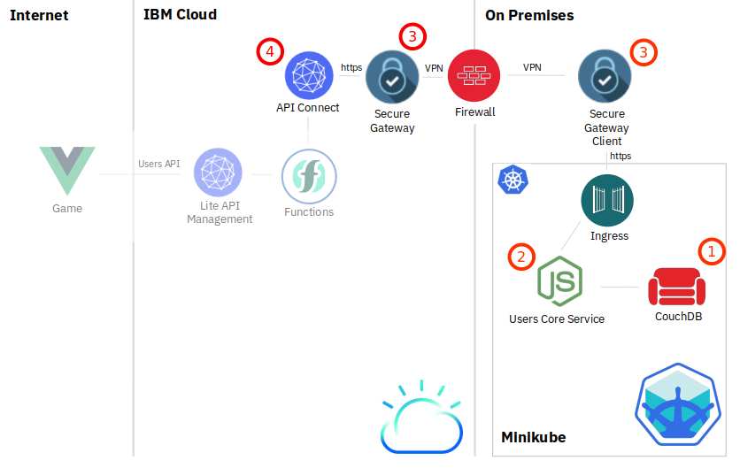

These are the major components:  

1. __CouchDB__
    - Uses official CouchDB docker image.
    - Deployed as single node Kubernetes deployment with persistent volumes for data storage. 
    - See *service/couchdb-k8s* directory.
2. __Users API__
    - Node.js microservice.
    - Implemented as Kubernetes deployment on Minikube.
    - Connect to CouchDB with nano driver and Kube DNS for address resolution.
    - Expose API URIs (/registeruser, etc) via Express and Kubernetes Ingress using a self-signed certificate.
    - Access restricted with HTTP Basic Auth.
    - See *service/users-api* directory.
3. __Secure Gateway__
    - Make API accessible from IBM Cloud although it is running locally behind a firewall.
4. __API Connect__
    - Manage and secure the exposed API.
    - Access to the API Connect managed Users API requires an API Key. 
    - See *service-api* directory.
5. __Functions API__
    - Serverless approach to secure the Users API and the API's credentials
    - Option to later extend this with IBM AppID service for user login.
    - For details look at [functions-api/README.md](functions-api/README.md)

  

### Security

- The Kubernetes ingress used to access the Users API is secured by a self-signed SSL certificate and HTTP Basic Authentication
- Secure Gateway Client running on-premise holds this self-signed certificate and routes API REST calls via https to the Users API
- Secure Gateway Service on IBM Cloud exposes the Ingress on a Secure Gateway URL with an IBM owned (and officially signed) SSL certificate.
- Tunnel between Secure Gateway Service on IBM Cloud and Secure Client Client on-premise is encrypted
- This means that User API calls via Secure Gateway use https and HTTP Basic Authentication
- API Connect "hides" the Secure Gateway: When making a REST call against API Connect it will invoke the Users API on-premise via Secure Gateway using the Users API Basic Authentication credentials
- Access to API Connect itself is restricted by an API Key

### Setup The Local Environment: Minikube

This has been tested on a Linux machine with Ubuntu 18.04 and VirtualBox as hypervisor. On a Mac it should be very similar, should work on Windows, too, but you are on your own.

Minikube is a Kubernetes project, detailed information can be found [here](https://kubernetes.io/docs/setup/minikube/).

__Prereq:__ You need a hypervisor, [Virtualbox](http://virtualbox.org) is supported and free and you need Docker (instructions depending on your OS, often present in repositories) and [kubectl](https://kubernetes.io/docs/tasks/tools/install-kubectl/) installed locally.

1. Install Minikube

    ```
    curl -LO https://storage.googleapis.com/minikube/releases/latest/minikube-linux-amd64 \
   && sudo install minikube-linux-amd64 /usr/local/bin/minikube
    ```
    
2. Start Minikube

    `minikube start`

    Default are 2 vCPUs, 2 GB RAM, 20 GB disk, with more resources available resources use e.g.:
    
    `minikube start --cpus 4 --memory 4096 --disk-size 40g`

    (Info on Minikube configuration: https://darkowlzz.github.io/post/minikube-config/)

    This command takes some 10-15 minutes to complete.

3. Enable Kubernetes Ingress

    `minikube addons enable ingress`
    
    We will use ingress for the API service.

4. Open Kubernetes Dashboard

    `minikube dashboard`


### Kubernetes Deployment

#### SSL Certificate

- Create an SSL Certificate:

    Our deployment uses a hostname users-api.cloud for the API Ingress
   
    ```
    openssl req -x509 -newkey rsa:4096 -sha256 -nodes -keyout users-api.key -out users-api.crt \
    -subj "/CN=users-api.cloud" -days 365
    ```

- Modify the local hosts file

    In order to resolve the hostname 'users-api.cloud' you need to add it it to your local hosts file.

    -  Get Minikube IP with `minikube ip`
    -  Add this IP address to /etc/hosts, e.g.:
    
        `192.168.99.100 users-api.cloud`


          
#### Create Kubernetes TLS Secret

- From the directory where you created the SSL Certificate issue this command:

    `kubectl create secret tls users-api-cloud-tls --cert users-api.crt --key users-api.key`


#### CouchDB

Directory: users/couchdb-k8s

1. Deploy CouchDB 

    - `kubectl apply -f [users/couchdb-k8s/]couchdb-deployment-minikube.yaml`

    - Find CouchDB Nodeport with  `minikube service users-couchdb --url`  
    
        E.g. http://192.168.99.100:32001
      
    - Access CouchDB Fauxton Dashboard at http://192.168.99.100:32001/_utils
    
        - Select "Setup" (wrench) on the left side
        - click "Configure a single node"
        - enter Admin credentials (icpadmin/icpadmin in this demo)
        - click "Configure node"

    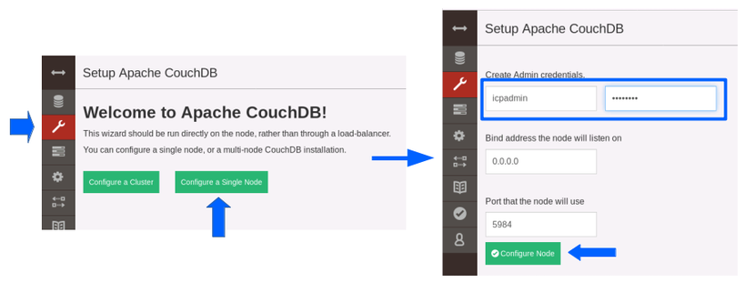


#### Users API Container Image and Deployment

Directory: users/service/users-api

There is a script `deploy2k8s.sh` that will automate the following steps:

- Use `eval $(minikube docker-env)` to create the Container (Docker) Image directly in Minikube. This redirects the local docker commands to the docker daemon within the Minikube VM. When you build a container image, it will be available to Minikube directly without using an external repository.

- `docker build -t users-api:VERSION .`

- Modify file K8s/users-api-deployment-minikube.yaml:

    - Adapt the image VERSION in spec:containers:image

    - There are 2 settings for environment variables in the spec:containers:env section:

        1. BASICAUTH contains a JSON object {userid: password} that is used for HTTP BASIC Auth in server.js. 
        2. COUCHDBURL is the URL that server.js requires to access CouchDB, there is no need to change this unless your CouchDB is on another server (or you want to use Cloudant on the IBM Cloud).

        If you modify the BASICAUTH settings, you need to modify API Connect configuration, too!

- `kubectl apply -f [users/users-api/K8s/]users-api-deployment-minikube.yaml`

This will create the microservice with a Kubernetes service and Kubernetes ingress that is associated with https://users-api.cloud.

You can now start to use the API locally in your browser, with curl, or using Postman. The base URL is https://users-api.cloud with HTTP Basic Authentication enabled.

Example:

`curl -k -H "Content-Type: application/json" -X POST -d '{"firstName": "Toni", "lastName": "Kroos", "email": "user@test.de", "signedTerms": "true", "registrationDate": "1547050380"}'  https://users-api.cloud/registeruser -u teeC7mee1i:coo0vahdo7nahToo1Om1ud2oo`

Result: `{"id": "Toni Kroos"}`

This will register Toni Kroos in the CouchDB using https with HTTP Basic Authentication (-u), curl is accepting a selfsigned cerificate (-k).


### Connect with IBM Cloud

#### Secure Gateway

In the next step we create a secure connection between the IBM Cloud and your local Minikube instance. The Secure Gateway Service is created on the IBM Cloud, a Secure Gatway Client is installed on the machine where Minikube is running.

__Note:__ Do not use the Secure Gateway Docker client, instead install the client locally. The Docker client cannot access the local /etc/hosts file and therefore is not able to resolve the hostname users-api.cloud into the minikube IP address.

IBM Secure Gateway documentation is [here](https://cloud.ibm.com/docs/services/SecureGateway/index.html#getting-started-with-sg).

##### Create a Secure Gatway Instance on IBM Cloud
1. Create a Secure Gateway Instance in your IBM Cloud account (section "Integration" in IBM Cloud Catalog)
2. Open the Secure Gateway dashboard
3. Add a Gateway and give it a name. For added security, you can leave "Require security token" checked, for simplicity you can uncheck it.

    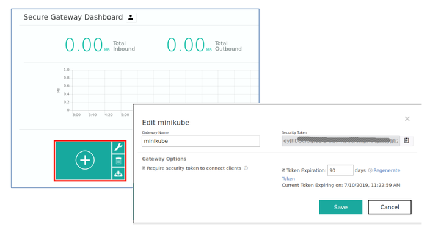

##### Install and configure Secure Gateway Client on-premise

4. Create a client, this happens on the machine where Minikube is installed.
       - Click on the Gateway tile ("minikube") and select the Clients tab
       - Tab "IBM Installer", download and follow the instructions for your OS.
       - During install, you need to enter the gateway ID and, if used, the security token
       - Leave logging level to INFO, leave path to ACL file empty
       - Yes for client UI, port is 9003
     
    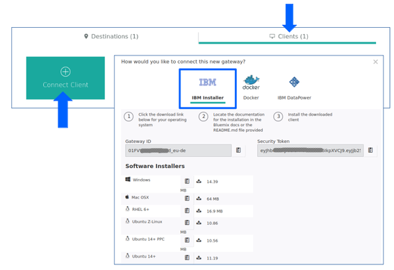

5. Check that Secure Gateway Client is running, on Linux this is `systemctl status securegateway_client`
       - If necessary start it with `systemctl start securegateway_client` 
6. Open the Client UI in your browser: http://localhost:9003
7. Click Access Control List
8. Allow access for 'users-api.cloud' at port 443
    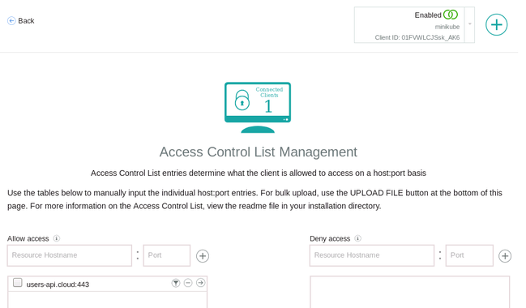

9. Go back to the main menu of the client UI and click on logs. You should see that the Secure Gateway tunnel is connected and your Client ID
##### Configure Secure Gateway on IBM Cloud
10. Go back to the Secure Gateway dashboard on the IBM Cloud to add a destination
11. Select "Advanced Setup"
12. Select "On-Premises Destination", enter "Users-API" as destination name, "users-api.cloud" for Hostname, 443 as port, select "HTTPS: Server Side" in the protocols pulldown.
13. Under TLS options, select "TLS" and upload the users-api.crt file from the SSL certificate we created earlier. Server Name Indicator is "users-api.cloud"
14. Click "Add destination"
    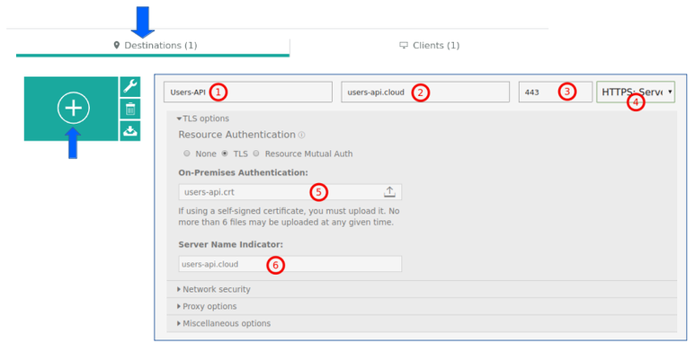

15. Click the wheel icon on your new destination. Cloud Host : Port is the URL for the Users API tunneled through the Secure Gateway, it looks like cap-eu-de-prod-XXX.cloud:15*** 

    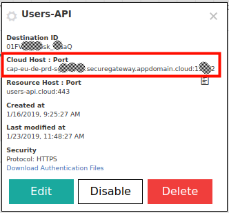

You can now test the API with this URL instead of https://users-api.cloud


#### API Connect

In this last step we use IBM API Gateway to expose the Secure Gateway Cloud URL in a secure fashion to developers, using a Client ID and Client Secret.

IBM API Connect documentation can be found [here](https://console.bluemix.net/docs/services/apiconnect/index.html).

##### Configuration
1. Open the file [users/service-api/]users-api_1.0.0.yaml in an editor. This is a Swagger file containing the definition for the Users API.
    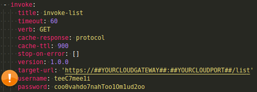
1. There are 4 instances of "target-url:  'https://##YOURCLOUDGATEWAY##:##YOURCLOUDPORT##/XXXXXX'
   This is the Cloud URL from the last step of the "Secure Gateway" section. **Modify the target-urls.**
1. If you **changed userid and password for HTTP Basic Auth** in the "Create Users API" section, you need to change the 4 username/password pairs located under target-url in the Swagger file, too.
4. Save the file.

##### Create API Connect Instance and import configuration
1. Create an API Connect instance in your IBM Cloud account (catalog, section "Integration")
1. Open the dashboard of your API Connect instance
1. Click on ">>" then Drafts, then select the "APIs" tab
1. Click "Add (+)", select "Import API from file or URL"

    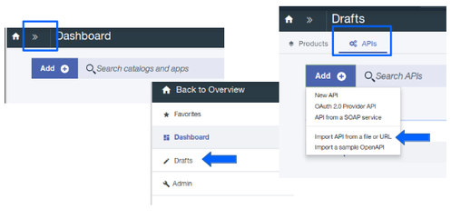

1. "Select File" [users/service-api/]users-api_1.0.0.yaml  
1. Check the box "Add a product", Title: "Users API", Name "users-api-product"
1. "Import"

    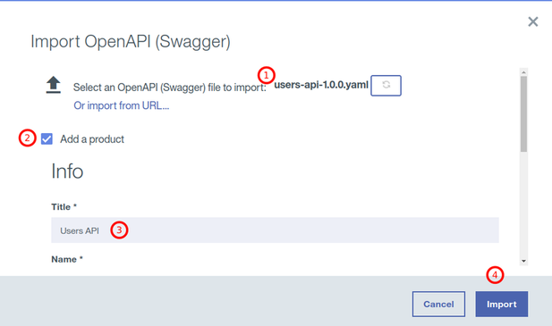


##### Publish the API
1. Open the product by clicking ">>", then "Drafts", then click on "users-api product"
1. Stage the product (Cloud icon in title bar), select "Sandbox". Sandbox is a product catalog already present in API Connect.

    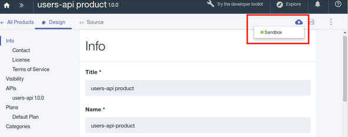
 
1. Go to the Sandbox catalog: ">>" then "Dashboard", the click "Sandbox" tile
1. Click on the three dots for your product and "Publish" it

    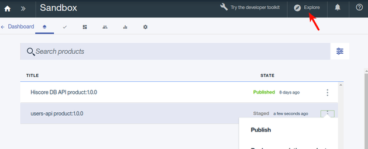

1. You can now test your API with "Explore" located in the title bar of API Connect dashboard.

    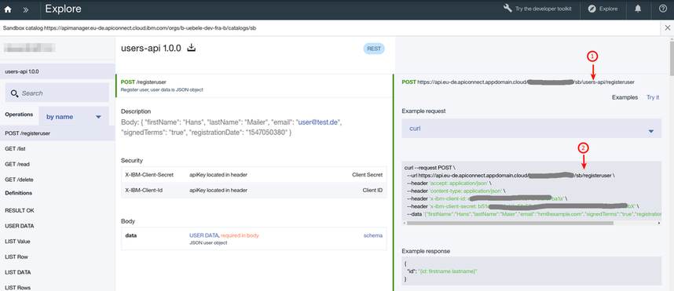

    **Note:** At the time of this writing there seems to be a bug in the API Connect Explorer. The URI at (2) is incorrect, it is missing "users-api". The URI at (1) is correct. 

You will need the URL at (1), e.g. "https://api.eu-de.apiconnect.appdomain.cloud/******/sb/users-api/" plus the values from the curl example for 'x-ibm-client-id' and 'x-ibm-client-secret' in the next step as parameters for the Bash automation. 

* IBMCLOUD_USERAPI_URL="https://api.eu-de.apiconnect.appdomain.cloud/.../sb/users-api/"
* IBMCLOUD_USERAPI_CLIENT_ID="abc...ba1a"
* IBMCLOUD_USERAPI_CLIENT_SECRET="bS1...bX"

Continue with [functions-api/README.md](functions-api/README.md).


